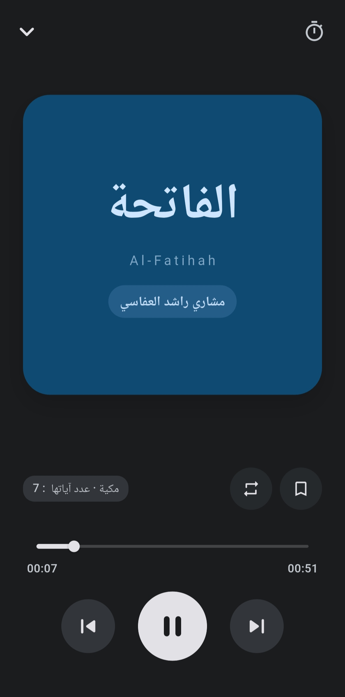
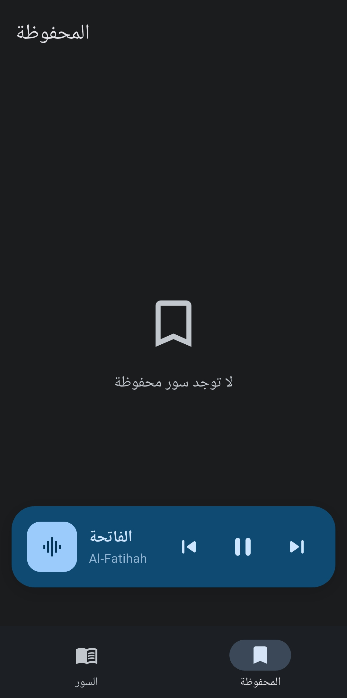
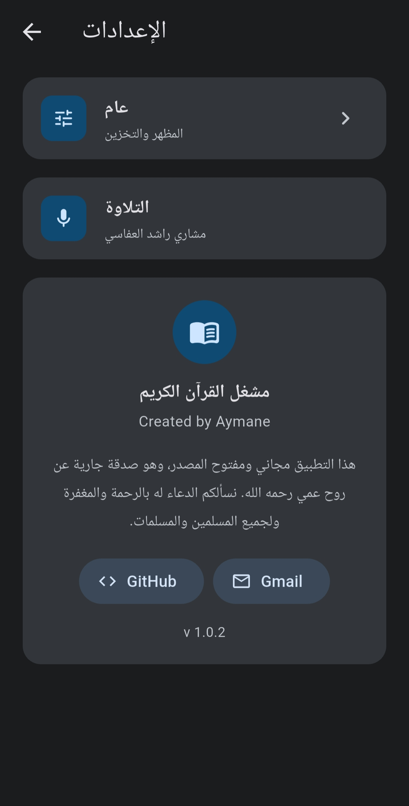

  

# قرآن Offline 🕌

An offline Quran MP3 player built with Flutter, featuring a modern Material Design 3 interface.

## Features

- 🎧 Listen to all 114 surahs recited by Sheikh Mishary Rashid Alafasy
- 📴 Surahs 85-114 available offline (no internet needed)
- 🌐 Stream surahs 1-84 online or download them for offline use
- 🌙 Light & dark theme following your phone's system theme
- ⏱️ Sleep timer (15, 30, 45, 60, 120 minutes)
- 🔁 Loop, shuffle, and normal play modes
- 🔖 Bookmark your favorite surahs
- 🔔 Background playback with notification controls

## Screenshots

  
  
  
  
  

## Download

> Requires Android 5.0+. Enable "Install from unknown sources" in your phone settings before installing.

## Built With

- [Flutter](https://flutter.dev)
- [just_audio](https://pub.dev/packages/just_audio)
- [just_audio_background](https://pub.dev/packages/just_audio_background)
- [provider](https://pub.dev/packages/provider)
- [dynamic_color](https://pub.dev/packages/dynamic_color)

## Reciter

All surahs are recited by **Sheikh Mishary Rashid Alafasy** (مشاري راشد العفاسي).

Audio source: [QuranicAudio.com](https://quranicaudio.com)

## License

MIT License — see [LICENSE](LICENSE) file for details.

